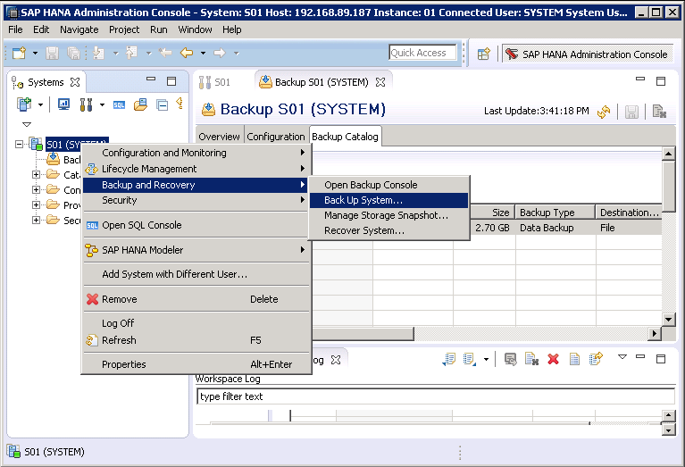
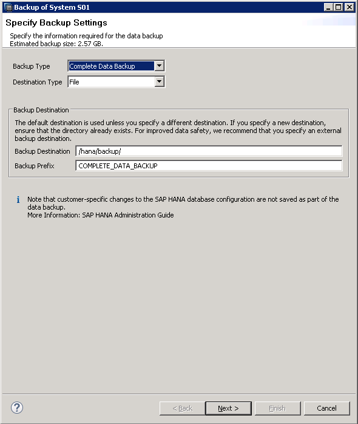

# 创建备份<a name="saphana_02_0058"></a>

## 操作场景<a name="zh-cn_topic_0063233740_section105671134125910"></a>

为了保证SAP HANA的可靠性，当SAP HANA的出现异常时能够进行恢复，需要创建数据备份。

以Windows上安装的SAP HANA Studio，全量备份SAP HANA为例，介绍备份操作的过程。

详细的要求和说明，请参见SAP公司的《[SAP HANA Database Backup and Recovery](https://help.sap.com/viewer/6b94445c94ae495c83a19646e7c3fd56/2.0.01/en-US/c4663eabbb571014923a90c70cec566c.html)》。

## 操作步骤<a name="zh-cn_topic_0063233740_section1680118393286"></a>

1.  在SAP HANA Studio界面上，选择要备份的SAP HANA系统，右键单击，并选择“Backup and Recovery  \>  Back Up System...“，如[图1](#zh-cn_topic_0063233740_fig15916142413292)所示。

    **图 1**  备份入口<a name="zh-cn_topic_0063233740_fig15916142413292"></a>  
    

2.  系统弹出界面如[图2](#zh-cn_topic_0063233740_fig13244144310617)所示，并配置备份参数。

    参数说明如下：

    -   Backup Type：备份的类型。此处选择“Complete Data Backup“，表示数据备份中包括了恢复数据库时要求的所有数据结构。
    -   Destination Type：备份目标类型。此处选择“File“，表示以文件的形式备份数据库。
    -   Backup Destination：备份的目标路径。默认的备份目标路径为配置时的路径，为“/hana/backup“。

        对于文件备份，请确保备份目标路径中的有足够的空间，可根据需要修改备份目标路径。

    -   Backup Prefix：备份文件的前缀名称。建议使用时间或日期作为标识，例如“COMPLETE\_DATA\_BACKUP\_20170622“。

        **图 2**  Specify Backup Settings界面<a name="zh-cn_topic_0063233740_fig13244144310617"></a>  
        


3.  单击“Next“。

    显示备份配置的概要信息。

4.  确保信息正确后，单击“Finish“。

    备份任务启动。

5.  备份完成后，提示备份完成，单击“Close“，关闭对话框。
6.  以root用户登录到SAP HANA所在的云服务器，进入“/hana/backup“并执行以下命令。

    **ls -l | grep** _COM_

    命令中“COM“表示查询以文件名称前缀为“COM“的文件。

    可查询到备份的文件列表，示例如下：

    ```
    -rw-r----- 1 s01adm sapsys     163840 Jun 23 16:22 COMPLETE_DATA_BACKUP_20170622_databackup_0_1
    -rw-r----- 1 s01adm sapsys   83894272 Jun 23 16:22 COMPLETE_DATA_BACKUP_20170622_databackup_1_1
    -rw-r----- 1 s01adm sapsys   83894272 Jun 23 16:22 COMPLETE_DATA_BACKUP_20170622_databackup_2_1
    -rw-r----- 1 s01adm sapsys 2181046272 Jun 23 16:22 COMPLETE_DATA_BACKUP_20170622_databackup_3_1
    -rw-r----- 1 s01adm sapsys  285220864 Jun 23 16:22 COMPLETE_DATA_BACKUP_20170622_databackup_4_1
    -rw-r----- 1 s01adm sapsys  285220864 Jun 23 16:22 COMPLETE_DATA_BACKUP_20170622_databackup_5_1
    ```


