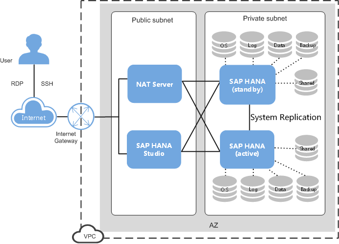
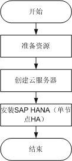

# 单节点部署（HA）

单节点部署（HA）方案如[图1](#fig57839126171047)和[图2](#fig893125064512)所示。

> **说明：**   
>在单节点部署（HA）场景下，支持手动进行主备节点的切换。也支持通过脚本自动进行主备节点的切换。  

**图 1**  单节点同AZ部署（HA）方案  

**图 2**  单节点跨AZ部署（HA）方案  

各部分的组成说明与[单节点部署（无HA）](单节点部署（无HA）.md)一致，主要差别为：两个位于同一AZ或不同AZ的独立SAP HANA节点，统一接入到SAP HANA Studio上进行管理。两个SAP HANA节点通过System Replication进行数据同步来实现HA功能。

部署流程如[图3](#fig5308712510196)所示。

**图 3**  单节点部署（HA）流程  

与单节点（无HA）场景相比，单节点（HA）的安装部署有如下差别：

-   创建服务器时，需要创建两台，且后续需要对这两台服务器进行时间同步配置、格式化磁盘和安装SAP HANA软件。
-   在SAP HANA Studio上，需要将两个SAP HANA节点接入到SAP Studio上。
-   需要手动为两个SAP HANA节点配置System Replication功能。
-   需要为两个SAP HANA节点配置脚本，以实现主备节点自动切换的功能。

    仅在SAP HANA的操作系统为SUSE Linux Enterprise Server \(SLES\) 12 SP1 for SAP及以上时支持。

-   采用单节点跨AZ部署（HA）方案时，Backup卷必需使用SFS，并且需要规划三台云服务器，将磁盘配置iSCSI实现共享存储用作SBD卷，详情请参考[配置iSCSI（跨AZ部署HA）](配置iSCSI（跨AZ部署HA）.md)。

