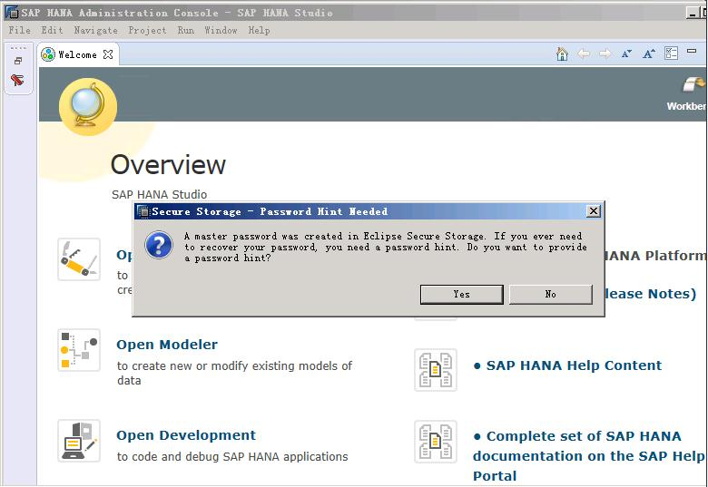

# 在SAP HANA Studio上接入SAP HANA

在SAP HANA Studio上接入SAP HANA节点后，才能对SAP  HANA节点进行管理。

以在Windows上安装的SAP HANA Studio上的操作为例介绍操作。

## 操作步骤

1.  打开SAP HANA Studio软件。

    在Studio所在的云服务器操作系统上，单击“开始  \>  SAP HANA  \>  SAP HANA Studio“，系统打开SAP HANA Studio的管理界面，并弹出“Workspace Launcher“对话框，如[图1](#fig48770107221958)所示。

    **图 1**  Workspace Launcher  
    

2.  设置好“Workspace“的目录后，勾选“Use this as the default and do not ask me again“，并单击“OK“。
3.  系统弹出“Security Storage“对话框，如[图2](#fig54921808221958)所示。单击“No“。

    **图 2**  Security Storage对话框  
    

4.  在“Overview“界面上，单击“Open Administration Console“，进入“SAP HANA Administration Console“界面。
5.  在“System“下，右键单击，如[图3](#fig2084510221958)所示。

    **图 3**  SAP HANA Administration Console界面  
    

6.  选择“Add System“，系统弹出“Specify System“界面，如[图4](#fig41119565221958)所示，输入相应的参数。

    关键参数说明如下：

    -   Host Name：填写SAP HANA云服务器的业务/客户端平面IP地址。
    -   Instance Number：填写SAP HANA节点上的实例编号。
    -   Mode：根据实际需求选择模式，需要指出的是SAP HANA 2.0时只能选择“Multiple containers”，而且必须同时接入系统DB和租户DB并运行在系统DB上才可以设置备份路径。

    **图 4**  Specify System界面  
    

7.  单击“Next“，系统弹出“System“界面，如[图5](#fig28428815221958)所示。选择“Authentication by database user“，并输入用户名和密码。

    用户名和密码为安装SAP HANA软件时设置的数据库用户名和密码。用户名固定为“SYSTEM“。

    **图 5**  System界面  
    

8.  单击“Next“，然后单击“Finish“，SAP HANA Studio自动连接数据库。

    若连接失败，请检查SAP HANA节点上的数据库实例是否已处于运行状态。

9.  在“SAP HANA Administration Console“界面的“System“下，双击要检查的节点。
10. 在右侧界面中，单击“Landscape“页签，查看SAP HANA节点上的各个进程状态，如[图6](#fig52736614221958)所示。

    绿色表示状态正常。

    **图 6**  Landscape界面  
    

