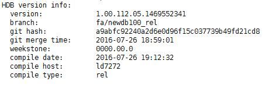

# 安装SAP HANA软件<a name="saphana_02_0033"></a>

在服务器上部署SAP HANA数据库软件。本章安装以SAP  HANA 1.0安装包为例，用户可自行从官网下载安装包。

## 前提条件<a name="section1553389185034"></a>

-   已准备好相关的资源，具体请参见资源准备相关章节。
-   已完成服务器的创建和磁盘格式化，并已完成相关的配置。
-   已完成服务器的时间同步配置。

## 操作步骤<a name="section38228028103625"></a>

1.  登录[http://support.sap.com/swdc](http://support.sap.com/swdc)下载安装包，然后执行安装。
    1.  打开“SAP Software Download Center“。
        -   选择“Software Downloads“
        -   选择“INSTALLATIONS & UPGRADES“
        -   选择“By Alphabetical Index \(A-Z\)“
        -   选择“H“
        -   选择“SAP HANA PLATFORM EDITION“
        -   选择“DOWNLOADS“

    2.  在“DOWNLOADS“窗口中，找到要下载的版本并将下载到本地硬盘。
    3.  将获取的安装包传至待安装SAP HANA软件的服务器的**/hana/shared**目录下并解压。
    4.  进入到安装文件所在的目录。

        例如，安装文件在“/DATA\_UNITS/HDB\_SERVER\_LINUX\_X86\_64“下

        **cd /DATA\_UNITS/HDB\_SERVER\_LINUX\_X86\_64**

    5.  增加文件夹的可执行权限。

        **chmod -R 777 /hana**

    6.  执行安装。

        **./hdblcm --ignore=check\_signature\_file**

        系统提示如下：

        ```
        Choose installation
        
          Index | System             | Database Properties
          ------------------------------------------------
          1     | Install new system |
                |                    |
          2     | Exit (do nothing)  |
        
        Enter selected system index [2]: 
        ```

    7.  输入“1“后，按“Enter“键。

        系统提示如下：

        ```
        Select additional components for installation:
        
          Index | Components | Description
          ---------------------------------------------
          1     | server     | No additional components
          2     | all        | All components
        
        Enter comma-separated list of the selected indices [1]:
        ```

    8.  输入“1“后，按“Enter“键。
    9.  按照界面的提示，输入参数后，按“Enter“键，逐个完成全部参数的设置。

        > **说明：**   
        >-   在配置过程中，如果要使用默认值，直接按“Enter“键。  
        >-   如果输入的参数有误 ，且已按“Enter“键，则可以按“Ctrl+C“键退出，并重新通过“./hdblcm --ignore=check\_signature\_file“命令进入安装界面。  

        参数配置要求如[表 1 SAP HANA安装参数说明](#table167861841192014)所示。

        **表 1**  SAP HANA安装参数说明

        <a name="table167861841192014"></a>
        <table><thead align="left"><tr id="row178694110204"><th class="cellrowborder" valign="top" width="35.53%" id="mcps1.2.3.1.1"><p id="p37861441102019"><a name="p37861441102019"></a><a name="p37861441102019"></a>参数</p>
        </th>
        <th class="cellrowborder" valign="top" width="64.47%" id="mcps1.2.3.1.2"><p id="p1278616417201"><a name="p1278616417201"></a><a name="p1278616417201"></a>说明</p>
        </th>
        </tr>
        </thead>
        <tbody><tr id="row1678664110202"><td class="cellrowborder" valign="top" width="35.53%" headers="mcps1.2.3.1.1 "><p id="p1878615410203"><a name="p1878615410203"></a><a name="p1878615410203"></a>Installation Path</p>
        </td>
        <td class="cellrowborder" valign="top" width="64.47%" headers="mcps1.2.3.1.2 "><p id="p778634114201"><a name="p778634114201"></a><a name="p778634114201"></a>默认为<span class="filepath" id="filepath1178618418200"><a name="filepath1178618418200"></a><a name="filepath1178618418200"></a>“/hana/shared/$SID”</span>，使用默认值。</p>
        </td>
        </tr>
        <tr id="row17861841202013"><td class="cellrowborder" valign="top" width="35.53%" headers="mcps1.2.3.1.1 "><p id="p177867413208"><a name="p177867413208"></a><a name="p177867413208"></a>Local Host Name</p>
        </td>
        <td class="cellrowborder" valign="top" width="64.47%" headers="mcps1.2.3.1.2 "><p id="p13786341112019"><a name="p13786341112019"></a><a name="p13786341112019"></a>使用本机名称。</p>
        </td>
        </tr>
        <tr id="row3786164142017"><td class="cellrowborder" valign="top" width="35.53%" headers="mcps1.2.3.1.1 "><p id="p16786124172011"><a name="p16786124172011"></a><a name="p16786124172011"></a>Do you want to add additional hosts to the system</p>
        </td>
        <td class="cellrowborder" valign="top" width="64.47%" headers="mcps1.2.3.1.2 "><p id="p15786841102016"><a name="p15786841102016"></a><a name="p15786841102016"></a>取值为<span class="parmname" id="parmname57867413207"><a name="parmname57867413207"></a><a name="parmname57867413207"></a>“n”</span>。</p>
        </td>
        </tr>
        <tr id="row87861241112018"><td class="cellrowborder" valign="top" width="35.53%" headers="mcps1.2.3.1.1 "><p id="p10786204114209"><a name="p10786204114209"></a><a name="p10786204114209"></a>SAP HANA System ID</p>
        </td>
        <td class="cellrowborder" valign="top" width="64.47%" headers="mcps1.2.3.1.2 "><p id="p1278624172013"><a name="p1278624172013"></a><a name="p1278624172013"></a>指定系统ID。系统ID是HANA系统中的一个标识，例如<span class="parmvalue" id="parmvalue878624112010"><a name="parmvalue878624112010"></a><a name="parmvalue878624112010"></a>“S00”</span>。</p>
        </td>
        </tr>
        <tr id="row57865415206"><td class="cellrowborder" valign="top" width="35.53%" headers="mcps1.2.3.1.1 "><p id="p97861411203"><a name="p97861411203"></a><a name="p97861411203"></a>Instance Number</p>
        </td>
        <td class="cellrowborder" valign="top" width="64.47%" headers="mcps1.2.3.1.2 "><p id="p8786641172017"><a name="p8786641172017"></a><a name="p8786641172017"></a>指定SAP HANA系统中的实例编号，例如<span class="parmvalue" id="parmvalue7786134111201"><a name="parmvalue7786134111201"></a><a name="parmvalue7786134111201"></a>“00”</span>。</p>
        <p id="p1478614192019"><a name="p1478614192019"></a><a name="p1478614192019"></a>实例编号在<a href="网络信息规划.md#section64580247162717">安全组规划</a>中被引用，需要与规划保持一致。</p>
        </td>
        </tr>
        <tr id="row13786104122018"><td class="cellrowborder" valign="top" width="35.53%" headers="mcps1.2.3.1.1 "><p id="p1678604110209"><a name="p1678604110209"></a><a name="p1678604110209"></a>Database Mode</p>
        </td>
        <td class="cellrowborder" valign="top" width="64.47%" headers="mcps1.2.3.1.2 "><p id="p6786124192014"><a name="p6786124192014"></a><a name="p6786124192014"></a>数据库的部署模式。使用默认值<span class="parmvalue" id="parmvalue1278644116201"><a name="parmvalue1278644116201"></a><a name="parmvalue1278644116201"></a>“single_container”</span>&nbsp;，安装HANA2.0时，无需设置该参数，默认支持<span class="uicontrol" id="uicontrol16744227202713"><a name="uicontrol16744227202713"></a><a name="uicontrol16744227202713"></a>“multiple container”</span>。</p>
        </td>
        </tr>
        <tr id="row978664142017"><td class="cellrowborder" valign="top" width="35.53%" headers="mcps1.2.3.1.1 "><p id="p1578611412204"><a name="p1578611412204"></a><a name="p1578611412204"></a>System Usage</p>
        </td>
        <td class="cellrowborder" valign="top" width="64.47%" headers="mcps1.2.3.1.2 "><p id="p1278618411205"><a name="p1278618411205"></a><a name="p1278618411205"></a>指定安装的SAP HANA系统的使用类型。请根据实际选择。该参数保存在 <span class="filepath" id="filepath578611417200"><a name="filepath578611417200"></a><a name="filepath578611417200"></a>“global.ini”</span> 文件中，可用于标识SAP HANA系统的用途。</p>
        </td>
        </tr>
        <tr id="row4786184162013"><td class="cellrowborder" valign="top" width="35.53%" headers="mcps1.2.3.1.1 "><p id="p1578624172013"><a name="p1578624172013"></a><a name="p1578624172013"></a>Location of Data Volumes Specifies</p>
        </td>
        <td class="cellrowborder" valign="top" width="64.47%" headers="mcps1.2.3.1.2 "><p id="p8786104110207"><a name="p8786104110207"></a><a name="p8786104110207"></a>指定系统的Data卷目录，为<span class="filepath" id="filepath187862418204"><a name="filepath187862418204"></a><a name="filepath187862418204"></a>“/hana/data/$SID”</span>。</p>
        </td>
        </tr>
        <tr id="row4786741122013"><td class="cellrowborder" valign="top" width="35.53%" headers="mcps1.2.3.1.1 "><p id="p778664111204"><a name="p778664111204"></a><a name="p778664111204"></a>Location of Log Volumes</p>
        </td>
        <td class="cellrowborder" valign="top" width="64.47%" headers="mcps1.2.3.1.2 "><p id="p17786174111205"><a name="p17786174111205"></a><a name="p17786174111205"></a>指定系统的Log卷目录，为<span class="filepath" id="filepath77860415205"><a name="filepath77860415205"></a><a name="filepath77860415205"></a>“/hana/log/$SID”</span>。</p>
        </td>
        </tr>
        <tr id="row77862041102011"><td class="cellrowborder" valign="top" width="35.53%" headers="mcps1.2.3.1.1 "><p id="p18786184110205"><a name="p18786184110205"></a><a name="p18786184110205"></a>Restrict maximum memory allocation?</p>
        </td>
        <td class="cellrowborder" valign="top" width="64.47%" headers="mcps1.2.3.1.2 "><p id="p57861441132018"><a name="p57861441132018"></a><a name="p57861441132018"></a>指定是否限制最大内存分配功能，使用默认值<span class="parmname" id="parmname77861541142015"><a name="parmname77861541142015"></a><a name="parmname77861541142015"></a>“n”</span>。</p>
        </td>
        </tr>
        <tr id="row167867419205"><td class="cellrowborder" valign="top" width="35.53%" headers="mcps1.2.3.1.1 "><p id="p978615410206"><a name="p978615410206"></a><a name="p978615410206"></a>Certificate Host Name</p>
        </td>
        <td class="cellrowborder" valign="top" width="64.47%" headers="mcps1.2.3.1.2 "><p id="p67861741172011"><a name="p67861741172011"></a><a name="p67861741172011"></a>指定用于为SAP host agent生成self-signed SSL证书的主机名称。</p>
        </td>
        </tr>
        <tr id="row1778654111208"><td class="cellrowborder" valign="top" width="35.53%" headers="mcps1.2.3.1.1 "><p id="p15786164119200"><a name="p15786164119200"></a><a name="p15786164119200"></a>SAP Host Agent User (sapadm) Password</p>
        </td>
        <td class="cellrowborder" valign="top" width="64.47%" headers="mcps1.2.3.1.2 "><p id="p147861741102015"><a name="p147861741102015"></a><a name="p147861741102015"></a>请根据实际输入。</p>
        </td>
        </tr>
        <tr id="row1778674142018"><td class="cellrowborder" valign="top" width="35.53%" headers="mcps1.2.3.1.1 "><p id="p3786041132013"><a name="p3786041132013"></a><a name="p3786041132013"></a>System Administrator (s00adm) Password</p>
        </td>
        <td class="cellrowborder" valign="top" width="64.47%" headers="mcps1.2.3.1.2 "><p id="p77862041142017"><a name="p77862041142017"></a><a name="p77862041142017"></a>请根据实际输入。</p>
        </td>
        </tr>
        <tr id="row878694172014"><td class="cellrowborder" valign="top" width="35.53%" headers="mcps1.2.3.1.1 "><p id="p67868413203"><a name="p67868413203"></a><a name="p67868413203"></a>System Administrator Home Directory</p>
        </td>
        <td class="cellrowborder" valign="top" width="64.47%" headers="mcps1.2.3.1.2 "><p id="p17862041192014"><a name="p17862041192014"></a><a name="p17862041192014"></a>使用默认值 。</p>
        </td>
        </tr>
        <tr id="row678694111209"><td class="cellrowborder" valign="top" width="35.53%" headers="mcps1.2.3.1.1 "><p id="p878620419205"><a name="p878620419205"></a><a name="p878620419205"></a>System Administrator Login Shell</p>
        </td>
        <td class="cellrowborder" valign="top" width="64.47%" headers="mcps1.2.3.1.2 "><p id="p177861541152016"><a name="p177861541152016"></a><a name="p177861541152016"></a>使用默认值 。</p>
        </td>
        </tr>
        <tr id="row7786204113206"><td class="cellrowborder" valign="top" width="35.53%" headers="mcps1.2.3.1.1 "><p id="p1378624117206"><a name="p1378624117206"></a><a name="p1378624117206"></a>System Administrator User ID</p>
        </td>
        <td class="cellrowborder" valign="top" width="64.47%" headers="mcps1.2.3.1.2 "><p id="p37861641142018"><a name="p37861641142018"></a><a name="p37861641142018"></a>使用默认值 。</p>
        </td>
        </tr>
        <tr id="row4786124117207"><td class="cellrowborder" valign="top" width="35.53%" headers="mcps1.2.3.1.1 "><p id="p18786144122012"><a name="p18786144122012"></a><a name="p18786144122012"></a>ID of User Group</p>
        </td>
        <td class="cellrowborder" valign="top" width="64.47%" headers="mcps1.2.3.1.2 "><p id="p107861141162019"><a name="p107861141162019"></a><a name="p107861141162019"></a>使用默认值 。</p>
        </td>
        </tr>
        <tr id="row15786124115207"><td class="cellrowborder" valign="top" width="35.53%" headers="mcps1.2.3.1.1 "><p id="p1778654122015"><a name="p1778654122015"></a><a name="p1778654122015"></a>Database User (SYSTEM) Password</p>
        </td>
        <td class="cellrowborder" valign="top" width="64.47%" headers="mcps1.2.3.1.2 "><p id="p13786154192010"><a name="p13786154192010"></a><a name="p13786154192010"></a>请根据实际输入。</p>
        </td>
        </tr>
        </tbody>
        </table>

    10. 配置完成，在“Restart system after machine reboot?“项处，根据场景进行操作：

        -   单节点无HA场景时，输入“y“。
        -   单节点HA场景下，不配置自动切换主备节点功能时，输入“y“；需配置自动切换主备节点功能（即HAE功能）时，输入“n“。

        然后，按“Enter“键，系统弹出安装概要信息。

    11. 确认安装信息无误后，在“Do you want to continue ?“项处，输入“y“，按“Enter“，开始进行SAP HANA安装。

        安装完成后，系统提示“Installation done“。


2.  检查安装结果。
    1.  切换到“/hana/shared/$SID/HDB00/“目录。

        例如

        **cd /hana/shared/S00/HDB00**

    2.  切换到数据库系统管理员用户。

        管理员帐号为安装过程中界面提示的“s00adm“。

        **su - s00adm**

    3.  查询数据库的版本。

        如果能查询到版本信息，则表示数据库软件安装成功。

        **HDB -version**

        数据库安装成功，系统返回的版本信息。示例如[图1](#fig33656113221256)所示。

        **图 1**  SAP HANA版本查询<a name="fig33656113221256"></a>  
        


3.  检查数据库进程是否运行正常。
    1.  执行命令，检查进程。

        “00“为SAP HANA的实例ID。

        **sapcontrol -nr  _00_  -function GetProcessList**

        系统返回结果示例如下，“dispstatus“为“GREEN“表示进程正常。

        ```
        13.04.2017 16:04:15
        GetProcessList
        OK
        name, description, dispstatus, textstatus, starttime, elapsedtime, pid
        hdbdaemon, HDB Daemon, GREEN, Running, 2017 04 13 11:18:33, 4:45:42, 3013
        hdbcompileserver, HDB Compileserver, GREEN, Running, 2017 04 13 11:18:42, 4:45:33, 3154
        hdbindexserver, HDB Indexserver, GREEN, Running, 2017 04 13 11:18:47, 4:45:28, 3180
        hdbnameserver, HDB Nameserver, GREEN, Running, 2017 04 13 11:18:34, 4:45:41, 3027
        hdbpreprocessor, HDB Preprocessor, GREEN, Running, 2017 04 13 11:18:42, 4:45:33, 3156
        hdbwebdispatcher, HDB Web Dispatcher, GREEN, Running, 2017 04 13 11:19:09, 4:45:06, 3513
        hdbxsengine, HDB XSEngine, GREEN, Running, 2017 04 13 11:18:47, 4:45:28, 3182
        ```


    1.  退回到“root”用户模式。

        **exit**


4.  检查数据库的启动与关闭。
    1.  切换到“/hana/shared/$SID/HDB00/“目录。

        例如

        **cd /hana/shared/S00/HDB00**

    2.  切换到数据库系统管理员用户。

        管理员帐号为安装过程中界面提示的“s00adm“。

        **su - s00adm**

    3.  启动SAP HANA数据库。

        **HDB start**

    4.  关闭SAP HANA数据库

        **HDB stop**

    5.  重新启动SAP HANA数据库。

        检查完成后，需要重新启动SAP HANA数据库。

        **HDB restart**

    6.  退回到“root“用户模式。

        **exit**


