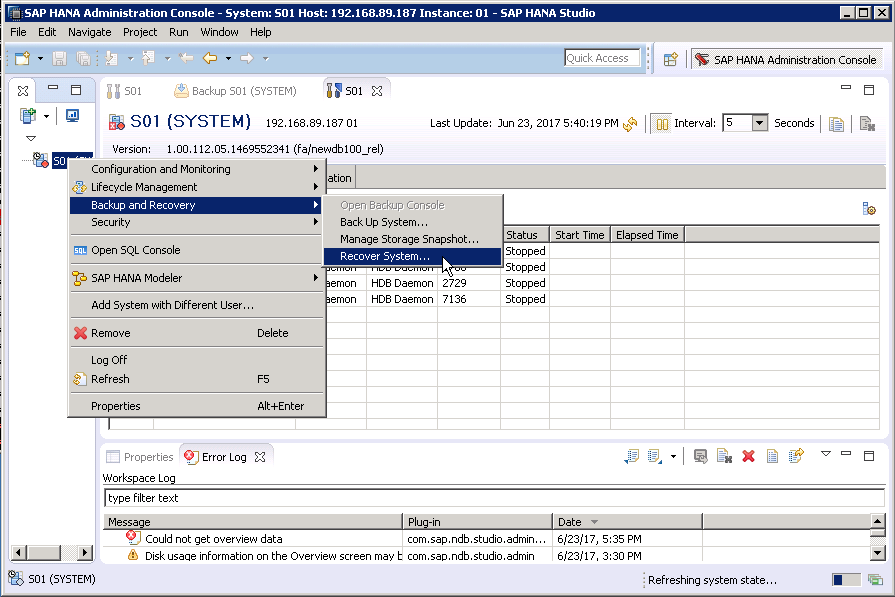
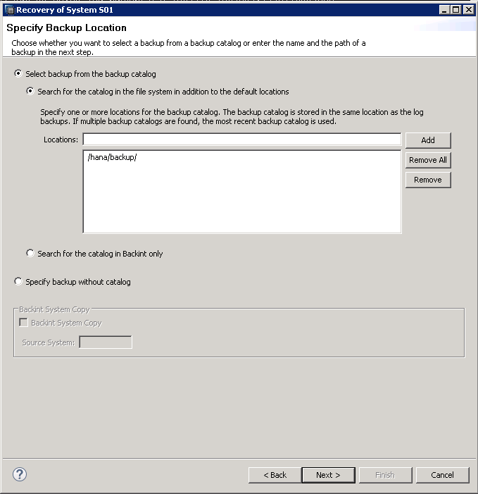

# 恢复SAP HANA数据库

## 操作场景

当SAP HANA的data卷、log卷不可用，或者出现其他异常，需要进行数据恢复时，可进行数据恢复。

以Windows上安装的SAP HANA Studio，按备份的文件恢复SAP HANA数据库，介绍恢复的操作过程。

详细的要求和说明，请参见SAP公司的《[SAP HANA Database Backup and Recovery](https://help.sap.com/viewer/6b94445c94ae495c83a19646e7c3fd56/2.0.01/en-US/c4663eabbb571014923a90c70cec566c.html)》。

## 操作步骤

1.  在SAP HANA Studio界面上，右键单击要停止的SAP HANA系统，并选择“Configuration and Monitoring  \>  Stop System...“。
2.  在弹出的界面上，“Shutdown Type“选择“Soft“，然后单击“OK“。
3.  根据界面提示，输入SAP HANA的系统管理员帐号和密码。

    假设SAP HANA的“SID“为“s01“，则系统管理员帐号为“s01adm“。

4.  选择要恢复的SAP HANA系统，右键单击，并选择“Backup and Recovery  \>  Recovery System...“，如[图1](#zh-cn_topic_0063795274_fig1213923544818)所示。

    **图 1**  恢复入口  
    

5.  在弹出的“Specify Recorvery Type“界面上，选择“Recovery the database to a specific data backup or storage snapshort“，单击“Next“。
6.  在弹出的“Specify Backup Location“界面上，保持默认的选项，如[图2](#zh-cn_topic_0063795274_fig195885014580)所示，单击“Next“。

    **图 2**  指定备份文件路径  
    

7.  在弹出的“Select a Backup“界面上，选择恢复时要使用的备份记录，单击“Next“。
8.  在弹出的“Other Settings“界面上，保持默认配置，单击“Next“。
9.  在弹出的概要信息界面上，单击“Finish“，开始进行恢复。
10. 恢复完成后，单击“Close“，关闭对话框。

    SAP HANA Studio上查看到SAP HANA已启动并正常运行。

