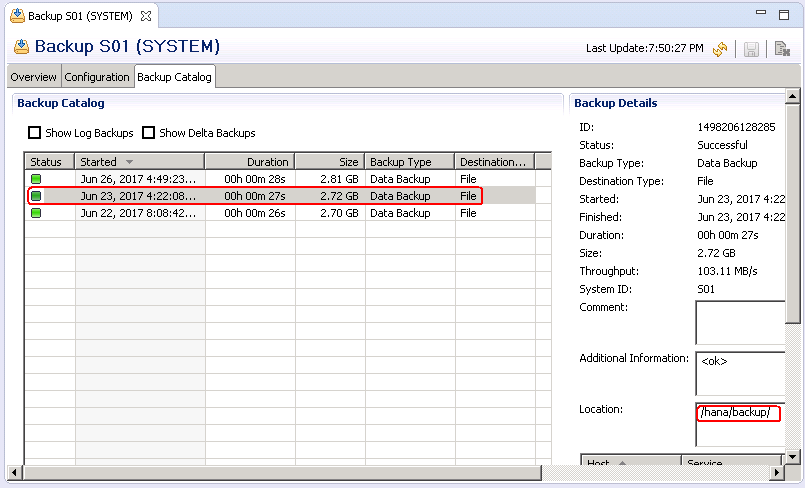

# 检查备份文件<a name="saphana_02_0060"></a>

## 操作场景<a name="zh-cn_topic_0064225095_section070919291192"></a>

在进行数据恢复之前，需要检查备份文件的完整性，避免备份过程出错。

详细的要求和说明，请参见SAP公司的《[SAP HANA Database Backup and Recovery](https://help.sap.com/viewer/6b94445c94ae495c83a19646e7c3fd56/2.0.01/en-US/c4663eabbb571014923a90c70cec566c.html)》。

## 操作步骤<a name="zh-cn_topic_0064225095_section10709182915917"></a>

1.  在SAP HANA studio上，选择SAP HANA系统，右键单击，选择“Backup and Recovery  \>  Open Backup Console“。
2.  在弹出的界面上，单击Backup Catalog，选择待检查的备份文件，查看其所在的路径，如[图1](#zh-cn_topic_0064225095_fig163301451214)所示。

    **图 1**  查看备份文件所在路径<a name="zh-cn_topic_0064225095_fig163301451214"></a>  
    

3.  以root用户登录到备份文件所在的云服务器，并切换到SAP HANA系统管理员帐号。

    假设SAP HANA的“SID“为“s01“，则系统管理员帐号为“s01adm“。

    **su -** _s01_**adm**

4.  进入到备份文件所在的目录。

    **cd /hana/backup**

5.  查询备份文件的名称

    **ls -l | grep** _COM_

    命令中“COM“表示查询以文件名称前缀为“COM“的文件。

    可查询到备份的文件列表，示例如下：

    ```
    -rw-r----- 1 s01adm sapsys     163840 Jun 23 16:22 COMPLETE_DATA_BACKUP_20170622_databackup_0_1
    -rw-r----- 1 s01adm sapsys   83894272 Jun 23 16:22 COMPLETE_DATA_BACKUP_20170622_databackup_1_1
    -rw-r----- 1 s01adm sapsys   83894272 Jun 23 16:22 COMPLETE_DATA_BACKUP_20170622_databackup_2_1
    -rw-r----- 1 s01adm sapsys 2181046272 Jun 23 16:22 COMPLETE_DATA_BACKUP_20170622_databackup_3_1
    -rw-r----- 1 s01adm sapsys  285220864 Jun 23 16:22 COMPLETE_DATA_BACKUP_20170622_databackup_4_1
    -rw-r----- 1 s01adm sapsys  285220864 Jun 23 16:22 COMPLETE_DATA_BACKUP_20170622_databackup_5_1
    ```

6.  <a name="zh-cn_topic_0064225095_li871016296919"></a>执行命令，检查备份文件的完整性。

    **hdbbackupcheck** _COMPLETE\_DATA\_BACKUP\_20170622\_databackup\_0\_1_

    检查结果正常时，返回信息示例如下：

    ```
    Backup '/hana/backup/COMPLETE_DATA_BACKUP_20170622_databackup_0_1' successfully checked.
    ```

7.  重复执行[6](#zh-cn_topic_0064225095_li871016296919)，对其他的备份文件进行检查。

