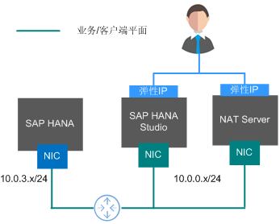
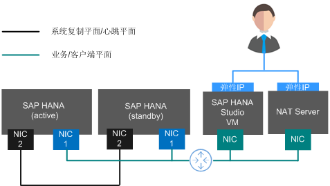

# 网络信息规划

## 网络平面规划（单节点无HA）

单节点（无HA）场景的网络如[图1](#fig39065894172513)所示。

> **说明：**   
>网段信息与IP地址信息均为示例，请根据实际规划。  

**图 1**  单节点（无HA）场景网络  

在该场景下，只使用一块网卡，作为网络通信平面。

规划的网络信息如[表1](#table35403468103944)所示。

**表 1**  网络信息规划（单节点无HA）

<table><thead align="left"><tr id="row44709710103944"><th class="cellrowborder" valign="top" width="33.33333333333333%" id="mcps1.2.4.1.1">
参数

</th>
<th class="cellrowborder" valign="top" width="33.33333333333333%" id="mcps1.2.4.1.2">
说明

</th>
<th class="cellrowborder" valign="top" width="33.33333333333333%" id="mcps1.2.4.1.3">
示例

</th>
</tr>
</thead>
<tbody><tr id="row57964509103944"><td class="cellrowborder" valign="top" width="33.33333333333333%" headers="mcps1.2.4.1.1 ">
业务/客户端平面IP地址

</td>
<td class="cellrowborder" valign="top" width="33.33333333333333%" headers="mcps1.2.4.1.2 ">
SAP HANA节点通过该IP地址与SFS、ERP等业务端软件或SAP HANA Studio客户端软件进行通信。

</td>
<td class="cellrowborder" valign="top" width="33.33333333333333%" headers="mcps1.2.4.1.3 ">
SAP HANA节点：10.0.3.2

SAP HANA Studio：10.0.0.102

NAT Server：10.0.0.202

</td>
</tr>
<tr id="row33578930103944"><td class="cellrowborder" valign="top" width="33.33333333333333%" headers="mcps1.2.4.1.1 ">
弹性IP地址

</td>
<td class="cellrowborder" valign="top" width="33.33333333333333%" headers="mcps1.2.4.1.2 ">
租户可通过弹性IP地址（即公网IP地址），访问SAP HANA Studio和NAT Server。

</td>
<td class="cellrowborder" valign="top" width="33.33333333333333%" headers="mcps1.2.4.1.3 ">
自动分配。

</td>
</tr>
</tbody>
</table>

## 网络平面规划（单节点HA）

单节点（HA）场景的网络如[图2](#fig149011947838)所示。

> **说明：**   
>-   网段信息与IP地址信息均为示例，请根据实际规划。  
>-   在[图2](#fig149011947838)中，适用于使用脚本自动切换主备节点的场景（仅在SAP HANA节点的操作系统为SUSE Linux Enterprise Server 12 SP1 for SAP时支持），如果使用手动切换主备节点的功能，则不需要心跳平面的网卡。  
>-   业务平面（业务/客户端平面IP地址）和主备内部通信平面（系统复制通信平面IP地址、心跳平面IP地址）的IP地址要分配属于不同的子网段。  

**图 2**  单节点（HA）场景网络  

规划的网络信息如[表2](#table13975949104056)所示。

**表 2**  网络信息规划（单节点HA）

<table><thead align="left"><tr id="row50960880104056"><th class="cellrowborder" valign="top" width="33.33333333333333%" id="mcps1.2.4.1.1">
参数

</th>
<th class="cellrowborder" valign="top" width="33.33333333333333%" id="mcps1.2.4.1.2">
说明

</th>
<th class="cellrowborder" valign="top" width="33.33333333333333%" id="mcps1.2.4.1.3">
示例

</th>
</tr>
</thead>
<tbody><tr id="row15401646104056"><td class="cellrowborder" valign="top" width="33.33333333333333%" headers="mcps1.2.4.1.1 ">
业务/客户端平面IP地址

</td>
<td class="cellrowborder" valign="top" width="33.33333333333333%" headers="mcps1.2.4.1.2 ">
该平面作为主网卡的平面。SAP HANA节点通过该IP地址与SFS、ERP等业务端软件或SAP HANA Studio客户端软件进行通信。

</td>
<td class="cellrowborder" valign="top" width="33.33333333333333%" headers="mcps1.2.4.1.3 ">
SAP HANA节点：10.0.3.2～10.0.3.3

SAP HANA节点浮动IP地址：10.0.3.103

SAP HANA Studio：10.0.0.102

NAT Server：10.0.0.202

</td>
</tr>
<tr id="row2294377719536"><td class="cellrowborder" valign="top" width="33.33333333333333%" headers="mcps1.2.4.1.1 ">
系统复制通信平面IP地址

</td>
<td class="cellrowborder" valign="top" width="33.33333333333333%" headers="mcps1.2.4.1.2 ">
SAP HANA节点通过该平面进行System Replication。

</td>
<td class="cellrowborder" rowspan="2" valign="top" width="33.33333333333333%" headers="mcps1.2.4.1.3 ">
SAP HANA节点：10.0.4.2～10.0.4.3

</td>
</tr>
<tr id="row58121541195555"><td class="cellrowborder" valign="top" headers="mcps1.2.4.1.1 ">
心跳平面IP地址

</td>
<td class="cellrowborder" valign="top" headers="mcps1.2.4.1.2 ">
SAP HANA节点通过该平面传递心跳信号，以实现在节点异常时自动切换的功能。

</td>
</tr>
<tr id="row65555087104056"><td class="cellrowborder" valign="top" width="33.33333333333333%" headers="mcps1.2.4.1.1 ">
弹性IP地址

</td>
<td class="cellrowborder" valign="top" width="33.33333333333333%" headers="mcps1.2.4.1.2 ">
租户可通过弹性IP地址（即公网IP地址），访问SAP HANA Studio和NAT Server。

</td>
<td class="cellrowborder" valign="top" width="33.33333333333333%" headers="mcps1.2.4.1.3 ">
自动分配。

</td>
</tr>
</tbody>
</table>

## 安全组规划

> **说明：**   
>-   网段信息与IP地址信息均为示例，请根据实际规划。下面的安全组规则仅是推荐的最佳实践，租户根据自己的特殊要求，可设置自己的安全组规则。  
>-   下表中，\#\#表示SAP HANA的实例编号，例如“00“。此处需要与安装SAP HANA软件时指定的实例编号保持一致。  
>-   更多有关于SAP需要访问的特定端口和相应安全组规则，请参见[SAP官方文档](https://help.sap.com/viewer/575a9f0e56f34c6e8138439eefc32b16/2.0/en-US/616a3c0b1cc748238de9c0341b15c63c.md)。  

**表 3**  安全组规则（SAP HANA）

<table><thead align="left"><tr id="row4806688691233"><th class="cellrowborder" valign="top" width="25%" id="mcps1.2.5.1.1">
源地址

</th>
<th class="cellrowborder" valign="top" width="25%" id="mcps1.2.5.1.2">
协议

</th>
<th class="cellrowborder" valign="top" width="25%" id="mcps1.2.5.1.3">
端口范围

</th>
<th class="cellrowborder" valign="top" width="25%" id="mcps1.2.5.1.4">
说明

</th>
</tr>
</thead>
<tbody><tr id="row2084596891233"><td class="cellrowborder" colspan="4" valign="top" headers="mcps1.2.5.1.1 mcps1.2.5.1.2 mcps1.2.5.1.3 mcps1.2.5.1.4 ">
Inbound

</td>
</tr>
<tr id="row6831703102813"><td class="cellrowborder" valign="top" width="25%" headers="mcps1.2.5.1.1 ">
10.0.0.0/24

</td>
<td class="cellrowborder" valign="top" width="25%" headers="mcps1.2.5.1.2 ">
TCP

</td>
<td class="cellrowborder" valign="top" width="25%" headers="mcps1.2.5.1.3 ">
3##13

</td>
<td class="cellrowborder" valign="top" width="25%" headers="mcps1.2.5.1.4 ">
允许SAP HANA Studio访问SAP HANA。

</td>
</tr>
<tr id="row48135447102813"><td class="cellrowborder" valign="top" width="25%" headers="mcps1.2.5.1.1 ">
10.0.0.0/24

</td>
<td class="cellrowborder" valign="top" width="25%" headers="mcps1.2.5.1.2 ">
TCP

</td>
<td class="cellrowborder" valign="top" width="25%" headers="mcps1.2.5.1.3 ">
3##15

</td>
<td class="cellrowborder" valign="top" width="25%" headers="mcps1.2.5.1.4 ">
业务平面所使用的端口。

</td>
</tr>
<tr id="row53471440086"><td class="cellrowborder" valign="top" width="25%" headers="mcps1.2.5.1.1 ">
10.0.0.0/24

</td>
<td class="cellrowborder" valign="top" width="25%" headers="mcps1.2.5.1.2 ">
TCP

</td>
<td class="cellrowborder" valign="top" width="25%" headers="mcps1.2.5.1.3 ">
3##17

</td>
<td class="cellrowborder" valign="top" width="25%" headers="mcps1.2.5.1.4 ">
业务平面所使用的端口。

</td>
</tr>
<tr id="row990093322913"><td class="cellrowborder" valign="top" width="25%" headers="mcps1.2.5.1.1 ">
10.0.0.0/24

</td>
<td class="cellrowborder" valign="top" width="25%" headers="mcps1.2.5.1.2 ">
TCP

</td>
<td class="cellrowborder" valign="top" width="25%" headers="mcps1.2.5.1.3 ">
5##13

</td>
<td class="cellrowborder" valign="top" width="25%" headers="mcps1.2.5.1.4 ">
允许SAP HANA Studio访问sapstartsrv。

</td>
</tr>
<tr id="row35707964142132"><td class="cellrowborder" valign="top" width="25%" headers="mcps1.2.5.1.1 ">
10.0.0.0/24

</td>
<td class="cellrowborder" valign="top" width="25%" headers="mcps1.2.5.1.2 ">
TCP

</td>
<td class="cellrowborder" valign="top" width="25%" headers="mcps1.2.5.1.3 ">
22

</td>
<td class="cellrowborder" valign="top" width="25%" headers="mcps1.2.5.1.4 ">
允许以SSH协议访问SAP HANA。

</td>
</tr>
<tr id="row1767161319117"><td class="cellrowborder" valign="top" width="25%" headers="mcps1.2.5.1.1 ">
10.0.0.0/24

</td>
<td class="cellrowborder" valign="top" width="25%" headers="mcps1.2.5.1.2 ">
TCP

</td>
<td class="cellrowborder" valign="top" width="25%" headers="mcps1.2.5.1.3 ">
43##

</td>
<td class="cellrowborder" valign="top" width="25%" headers="mcps1.2.5.1.4 ">
允许从10.0.0.0/24子网以HTTPS协议访问XSEngine。

</td>
</tr>
<tr id="row187678131913"><td class="cellrowborder" valign="top" width="25%" headers="mcps1.2.5.1.1 ">
10.0.0.0/24

</td>
<td class="cellrowborder" valign="top" width="25%" headers="mcps1.2.5.1.2 ">
TCP

</td>
<td class="cellrowborder" valign="top" width="25%" headers="mcps1.2.5.1.3 ">
80##

</td>
<td class="cellrowborder" valign="top" width="25%" headers="mcps1.2.5.1.4 ">
允许从10.0.0.0/24子网以HTTP协议访问XSEngine。

</td>
</tr>
<tr id="row27671131117"><td class="cellrowborder" valign="top" width="25%" headers="mcps1.2.5.1.1 ">
10.0.0.0/24

</td>
<td class="cellrowborder" valign="top" width="25%" headers="mcps1.2.5.1.2 ">
TCP

</td>
<td class="cellrowborder" valign="top" width="25%" headers="mcps1.2.5.1.3 ">
8080 (HTTP)

</td>
<td class="cellrowborder" valign="top" width="25%" headers="mcps1.2.5.1.4 ">
允许Software Update Manager (SUM)以HTTP协议访问SAP HANA。

</td>
</tr>
<tr id="row1176714131319"><td class="cellrowborder" valign="top" width="25%" headers="mcps1.2.5.1.1 ">
10.0.0.0/24

</td>
<td class="cellrowborder" valign="top" width="25%" headers="mcps1.2.5.1.2 ">
TCP

</td>
<td class="cellrowborder" valign="top" width="25%" headers="mcps1.2.5.1.3 ">
8443 (HTTPS)

</td>
<td class="cellrowborder" valign="top" width="25%" headers="mcps1.2.5.1.4 ">
允许Software Update Manager (SUM)以HTTPS协议访问SAP HANA。

</td>
</tr>
<tr id="row67682131019"><td class="cellrowborder" valign="top" width="25%" headers="mcps1.2.5.1.1 ">
10.0.0.0/24

</td>
<td class="cellrowborder" valign="top" width="25%" headers="mcps1.2.5.1.2 ">
TCP

</td>
<td class="cellrowborder" valign="top" width="25%" headers="mcps1.2.5.1.3 ">
1128-1129

</td>
<td class="cellrowborder" valign="top" width="25%" headers="mcps1.2.5.1.4 ">
允许以SOAP/HTTP协议访问SAP Host Agent。

</td>
</tr>
<tr id="row4566296315455"><td class="cellrowborder" valign="top" width="25%" headers="mcps1.2.5.1.1 ">
系统自动指定。

</td>
<td class="cellrowborder" valign="top" width="25%" headers="mcps1.2.5.1.2 ">
ANY

</td>
<td class="cellrowborder" valign="top" width="25%" headers="mcps1.2.5.1.3 ">
ANY

</td>
<td class="cellrowborder" valign="top" width="25%" headers="mcps1.2.5.1.4 ">
系统默认创建的安全组规则。

允许属于同一个安全组的云服务器互相通信。

</td>
</tr>
<tr id="row2267095391251"><td class="cellrowborder" colspan="4" valign="top" headers="mcps1.2.5.1.1 mcps1.2.5.1.2 mcps1.2.5.1.3 mcps1.2.5.1.4 ">
Outbound

</td>
</tr>
<tr id="row6705956691251"><td class="cellrowborder" valign="top" width="25%" headers="mcps1.2.5.1.1 ">
ANY

</td>
<td class="cellrowborder" valign="top" width="25%" headers="mcps1.2.5.1.2 ">
ANY

</td>
<td class="cellrowborder" valign="top" width="25%" headers="mcps1.2.5.1.3 ">
ANY

</td>
<td class="cellrowborder" valign="top" width="25%" headers="mcps1.2.5.1.4 ">
系统默认创建的安全组规则。

允许SAP HANA访问全部对端。

</td>
</tr>
</tbody>
</table>

**表 4**  安全组规则（SAP HANA Studio）

<table><thead align="left"><tr id="row53861362205028"><th class="cellrowborder" valign="top" width="25%" id="mcps1.2.5.1.1">
源地址

</th>
<th class="cellrowborder" valign="top" width="25%" id="mcps1.2.5.1.2">
协议

</th>
<th class="cellrowborder" valign="top" width="25%" id="mcps1.2.5.1.3">
端口范围

</th>
<th class="cellrowborder" valign="top" width="25%" id="mcps1.2.5.1.4">
说明

</th>
</tr>
</thead>
<tbody><tr id="row24889674205028"><td class="cellrowborder" colspan="4" valign="top" headers="mcps1.2.5.1.1 mcps1.2.5.1.2 mcps1.2.5.1.3 mcps1.2.5.1.4 ">
Inbound

</td>
</tr>
<tr id="row25179773205028"><td class="cellrowborder" valign="top" width="25%" headers="mcps1.2.5.1.1 ">
0.0.0.0/0

</td>
<td class="cellrowborder" valign="top" width="25%" headers="mcps1.2.5.1.2 ">
TCP

</td>
<td class="cellrowborder" valign="top" width="25%" headers="mcps1.2.5.1.3 ">
3389

</td>
<td class="cellrowborder" valign="top" width="25%" headers="mcps1.2.5.1.4 ">
允许租户侧网络以RDP协议，访问SAP HANA Studio。

仅在SAP HANA Studio部署在Windows上时需要创建。

</td>
</tr>
<tr id="row46599935202055"><td class="cellrowborder" valign="top" width="25%" headers="mcps1.2.5.1.1 ">
0.0.0.0/0

</td>
<td class="cellrowborder" valign="top" width="25%" headers="mcps1.2.5.1.2 ">
TCP

</td>
<td class="cellrowborder" valign="top" width="25%" headers="mcps1.2.5.1.3 ">
22

</td>
<td class="cellrowborder" valign="top" width="25%" headers="mcps1.2.5.1.4 ">
允许租户侧网络以SSH协议，访问SAP HANA Studio。

仅在SAP HANA Studio部署在Linux上时需要创建。

</td>
</tr>
<tr id="row489652781582"><td class="cellrowborder" valign="top" width="25%" headers="mcps1.2.5.1.1 ">
系统自动指定。

</td>
<td class="cellrowborder" valign="top" width="25%" headers="mcps1.2.5.1.2 ">
ANY

</td>
<td class="cellrowborder" valign="top" width="25%" headers="mcps1.2.5.1.3 ">
ANY

</td>
<td class="cellrowborder" valign="top" width="25%" headers="mcps1.2.5.1.4 ">
系统默认创建的安全组规则。

允许属于同一个安全组的云服务器互相通信。

</td>
</tr>
<tr id="row48945387205028"><td class="cellrowborder" colspan="4" valign="top" headers="mcps1.2.5.1.1 mcps1.2.5.1.2 mcps1.2.5.1.3 mcps1.2.5.1.4 ">
Outbound

</td>
</tr>
<tr id="row46380966205028"><td class="cellrowborder" valign="top" width="25%" headers="mcps1.2.5.1.1 ">
ANY

</td>
<td class="cellrowborder" valign="top" width="25%" headers="mcps1.2.5.1.2 ">
ANY

</td>
<td class="cellrowborder" valign="top" width="25%" headers="mcps1.2.5.1.3 ">
ANY

</td>
<td class="cellrowborder" valign="top" width="25%" headers="mcps1.2.5.1.4 ">
系统默认创建的安全组规则。

允许SAP HANA Studio访问全部对端。

</td>
</tr>
</tbody>
</table>

**表 5**  安全组规则（NAT Server）

<table><thead align="left"><tr id="row2162819018494"><th class="cellrowborder" valign="top" width="25%" id="mcps1.2.5.1.1">
源地址

</th>
<th class="cellrowborder" valign="top" width="25%" id="mcps1.2.5.1.2">
协议

</th>
<th class="cellrowborder" valign="top" width="25%" id="mcps1.2.5.1.3">
端口范围

</th>
<th class="cellrowborder" valign="top" width="25%" id="mcps1.2.5.1.4">
说明

</th>
</tr>
</thead>
<tbody><tr id="row4049772218494"><td class="cellrowborder" colspan="4" valign="top" headers="mcps1.2.5.1.1 mcps1.2.5.1.2 mcps1.2.5.1.3 mcps1.2.5.1.4 ">
Inbound

</td>
</tr>
<tr id="row6204864718494"><td class="cellrowborder" valign="top" width="25%" headers="mcps1.2.5.1.1 ">
0.0.0.0/0

</td>
<td class="cellrowborder" valign="top" width="25%" headers="mcps1.2.5.1.2 ">
TCP

</td>
<td class="cellrowborder" valign="top" width="25%" headers="mcps1.2.5.1.3 ">
22

</td>
<td class="cellrowborder" valign="top" width="25%" headers="mcps1.2.5.1.4 ">
允许租户侧网络以SSH协议，访问NAT Server。

</td>
</tr>
<tr id="row28727535214"><td class="cellrowborder" valign="top" width="25%" headers="mcps1.2.5.1.1 ">
10.0.3.0/24

</td>
<td class="cellrowborder" valign="top" width="25%" headers="mcps1.2.5.1.2 ">
TCP

</td>
<td class="cellrowborder" valign="top" width="25%" headers="mcps1.2.5.1.3 ">
80 (HTTP)

</td>
<td class="cellrowborder" valign="top" width="25%" headers="mcps1.2.5.1.4 ">
允许以HTTP协议访问部署在同一VPC内的实例。

</td>
</tr>
<tr id="row10609135418212"><td class="cellrowborder" valign="top" width="25%" headers="mcps1.2.5.1.1 ">
10.0.3.0/24

</td>
<td class="cellrowborder" valign="top" width="25%" headers="mcps1.2.5.1.2 ">
TCP

</td>
<td class="cellrowborder" valign="top" width="25%" headers="mcps1.2.5.1.3 ">
443 (HTTPS)

</td>
<td class="cellrowborder" valign="top" width="25%" headers="mcps1.2.5.1.4 ">
允许以HTTPS协议访问部署在同一VPC内的实例。

</td>
</tr>
<tr id="row2537862915819"><td class="cellrowborder" valign="top" width="25%" headers="mcps1.2.5.1.1 ">
系统自动指定。

</td>
<td class="cellrowborder" valign="top" width="25%" headers="mcps1.2.5.1.2 ">
ANY

</td>
<td class="cellrowborder" valign="top" width="25%" headers="mcps1.2.5.1.3 ">
ANY

</td>
<td class="cellrowborder" valign="top" width="25%" headers="mcps1.2.5.1.4 ">
系统默认创建的安全组规则。

允许属于同一个安全组的云服务器互相通信。

</td>
</tr>
<tr id="row1995070418494"><td class="cellrowborder" colspan="4" valign="top" headers="mcps1.2.5.1.1 mcps1.2.5.1.2 mcps1.2.5.1.3 mcps1.2.5.1.4 ">
Outbound

</td>
</tr>
<tr id="row4854915118494"><td class="cellrowborder" valign="top" width="25%" headers="mcps1.2.5.1.1 ">
10.0.3.0/24

</td>
<td class="cellrowborder" valign="top" width="25%" headers="mcps1.2.5.1.2 ">
TCP

</td>
<td class="cellrowborder" valign="top" width="25%" headers="mcps1.2.5.1.3 ">
22 (SSH)

</td>
<td class="cellrowborder" valign="top" width="25%" headers="mcps1.2.5.1.4 ">
允许NAT Server以SSH协议访问10.0.3.0子网。

</td>
</tr>
<tr id="row1710125919314"><td class="cellrowborder" valign="top" width="25%" headers="mcps1.2.5.1.1 ">
0.0.0.0/0

</td>
<td class="cellrowborder" valign="top" width="25%" headers="mcps1.2.5.1.2 ">
TCP

</td>
<td class="cellrowborder" valign="top" width="25%" headers="mcps1.2.5.1.3 ">
80 (HTTP)

</td>
<td class="cellrowborder" valign="top" width="25%" headers="mcps1.2.5.1.4 ">
允许部署在VPC内的实例访问任意网络。

</td>
</tr>
<tr id="row1485705914311"><td class="cellrowborder" valign="top" width="25%" headers="mcps1.2.5.1.1 ">
0.0.0.0/0

</td>
<td class="cellrowborder" valign="top" width="25%" headers="mcps1.2.5.1.2 ">
TCP

</td>
<td class="cellrowborder" valign="top" width="25%" headers="mcps1.2.5.1.3 ">
443 (HTTPS)

</td>
<td class="cellrowborder" valign="top" width="25%" headers="mcps1.2.5.1.4 ">
允许部署在VPC内的实例访问任意网络。

</td>
</tr>
</tbody>
</table>

