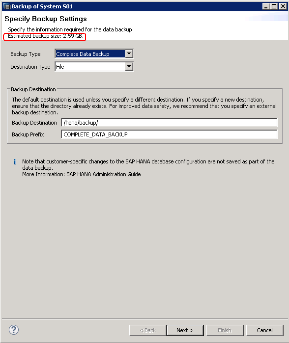

# 获取备份所需空间

在安装SAP HANA之前，确保已经对SAP HANA节点上的空间进行规划，“/hana/backup“空间的推荐值为SAP HANA内存空间大小的三倍或以上。

在创建备份的向导页面，会计算本次备份所需要的备份空间，如[图1](#zh-cn_topic_0063233739_fig129986594238)所示。

请在备份前，请确保“/hana/backup“目录下的空间足够。

**图 1**  备份空间计算  

